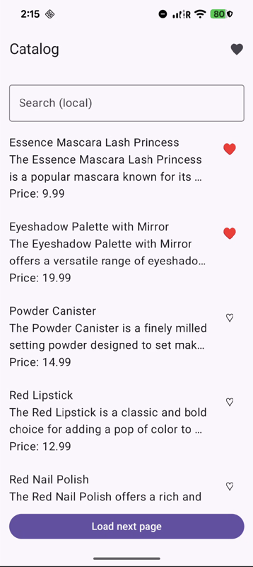
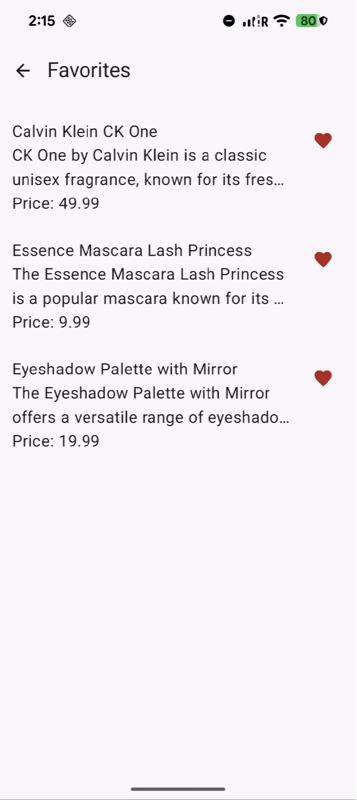
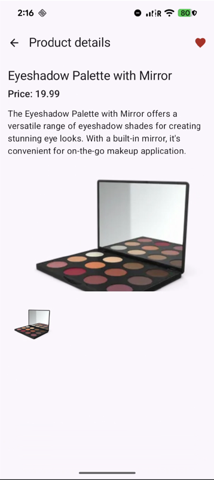

# Product Catalog (Kotlin Multiplatform)

This project implements a **Product Catalog feature** as a Kotlin Multiplatform application with an **offline-first** approach.
The app provides a catalog list with pagination, product details, and a favorites screen, while keeping the architecture clean,
testable, and ready for future iOS UI integration.

## Goal

Build a maintainable and scalable **Product Catalog** experience with:

- **Catalog list** (paginated)
- **Product search**
- **Product details**
- **Favorites management**
- **Offline-first behavior** (local DB as the single source of truth)

The UI always consumes data from the local database. When the internet is available, the app synchronizes remote data into the database.
When offline, the app continues to operate using cached data.

## Tech Stack

- **Kotlin Multiplatform (KMP)**
- **Compose Multiplatform**
    - Android UI is implemented using **Jetpack Compose**
- **Decompose** for navigation and component-based state management
- **Ktor Client** for networking
- **Room (KMP)** for local persistence
- **Koin** for dependency injection
- **Coroutines + Flow** for async operations and reactive DB updates
- **Unit tests** for domain and presentation logic

## Architecture

The project follows a **feature-first** structure with Clean Architecture principles inside each feature:

- `feature/catalog/api` — API contracts and DTOs
- `feature/catalog/data` — repository implementation, mappers, local/remote data sources, sync layer
- `feature/catalog/domain` — business models, repository interfaces, use-cases
- `feature/catalog/presentation` — Decompose components, UI state and presentation logic

### Offline-first strategy (Single Source of Truth)

- The local database is the **single source of truth**.
- UI observes data via `Flow` from Room DAOs.
- Network calls never update UI directly — they **synchronize into the database**.
- Synchronization is triggered by UI events (e.g. initial load, pagination, details open) and updates are reflected automatically.

This approach ensures consistent data flow, deterministic state management, and resilient behavior in unstable network conditions.

## Screenshots & App Flow

### Catalog


- Shows a paginated list of products stored in the local database.
- Tap the **Favorites** icon in the top-right corner to open the Favorites screen.
- Type in the search field to filter the currently loaded items by **title** or **description**.
- Tap a product row to open **Product Details**.
- Tap the heart icon to **add/remove** a product from Favorites.
- Tap **Load next page** to fetch and persist the next portion of products.

### Favorites


- Displays only products marked as favorites (from the local database).
- Tap a product to open **Product Details**.
- Tap the red heart icon to remove a product from Favorites.
- Use the back arrow to return to the Catalog screen.

### Product Details


- Displays product information from the local database: title, formatted price, description.
- Shows the main image and a horizontal gallery (images load progressively).
- Tap the heart icon to toggle Favorites for this product.
- Use the back arrow to return to the previous screen.

## Demonstration


The GIF demonstrates the main flows of the app:

- **Offline-first behavior:** the app works without crashing when launched offline (empty state is shown).
- **Manual pagination:** products are loaded page-by-page via **Load next page** (no auto-loading on scroll).
- **Local search:** filters the currently loaded products by title/description.
- **Favorites:** add/remove products using the heart icon and view them in the Favorites screen.
- **Product details:** open a product to see its details and image gallery.

### Build and Run Android Application

To build and run the development version of the Android app, use the run configuration from the run widget
in your IDE’s toolbar or build it directly from the terminal:
- on macOS/Linux
  ```shell
  ./gradlew :composeApp:assembleDebug
  ```
- on Windows
  ```shell
  .\gradlew.bat :composeApp:assembleDebug
  ```